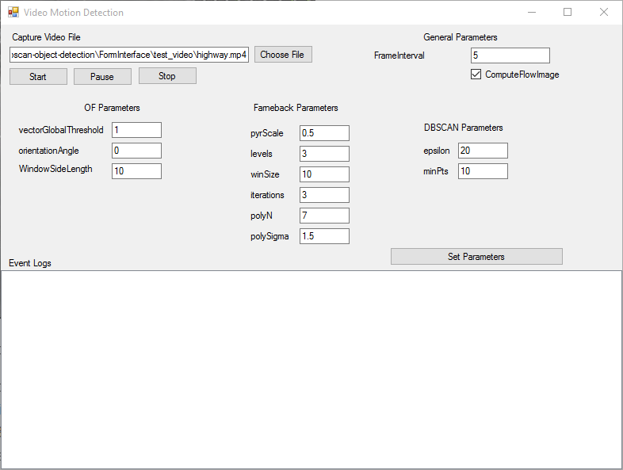

# of-dbscan-object-detection

This is source code of my blog post talks about hybrid algorithm that detects objects in stable videos. It is a combination of Optical Flows and DBSCAN algorithms. 

Please check my blog post for more info: https://ysfuz.com/2016/07/13/video-processing-example-using-optical-flows-and-dbscan-algorithm/

Don't forget to install EmguCV library and fix reference links in project files to your computer's installation path. 
Also copy x86\cvextern, x86\msvcp120, x86\msvcr120, x86\opencv_ffmpeg310 dll files into emgudll folder.

